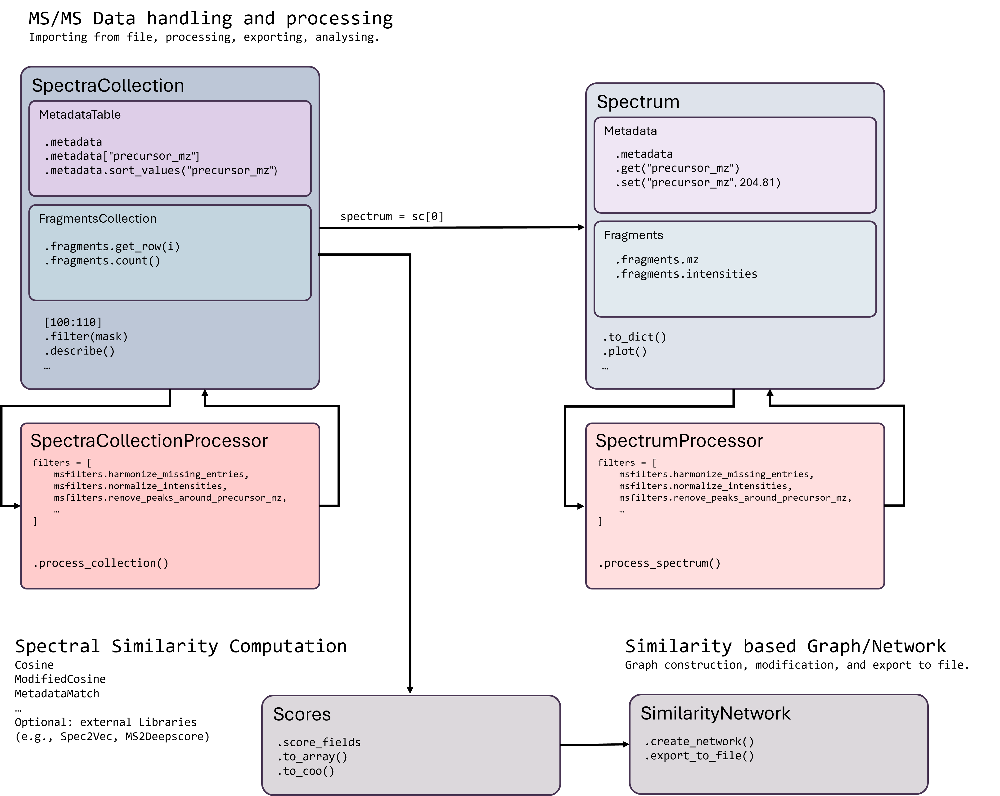

`fair-software.nl <https://fair-software.nl/>`_ recommendations:

|GitHub Badge|
|License Badge|
|Conda Badge| |Pypi Badge| |Research Software Directory Badge|
|Zenodo Badge|
|CII Best Practices Badge| |Howfairis Badge|

Code quality checks:

|CI First Code Checks| |CI Build|
|ReadTheDocs Badge|
|Sonarcloud Quality Gate Badge| |Sonarcloud Coverage Badge|

matchms
=======

Matchms is an open-source Python package for importing, processing, cleaning,
exporting, and comparing tandem mass spectrometry data (MS/MS). It supports
reproducible workflows that transform raw spectra from common file formats into
cleaned, harmonized, and comparable spectral datasets.

The preferred way to work with matchms is now through
`SpectraCollection`: a collection-level representation for complete MS/MS
datasets. A `SpectraCollection` keeps metadata and fragment peak data
synchronized, supports table-like inspection and filtering, and provides a
natural basis for scalable dataset-level processing and similarity computation.

Matchms supports popular spectral data formats including mzML, mzXML, MSP, MGF,
metabolomics-USI, JSON, and pickle. It provides tools for metadata
harmonization, metadata validation, peak filtering, spectrum processing,
collection processing, export, and large-scale spectral similarity calculations.

The classic `Spectrum` API remains supported. Individual spectra are still
represented as `Spectrum` objects, and existing workflows that process lists
of spectra continue to work. For new workflows, however, `SpectraCollection`
is recommended whenever a complete dataset is imported, cleaned, filtered,
exported, or compared.

Citation
========

If you use matchms in your research, please cite the following software papers:  

F Huber, S. Verhoeven, C. Meijer, H. Spreeuw, E. M. Villanueva Castilla, C. Geng, J.J.J. van der Hooft, S. Rogers, A. Belloum, F. Diblen, J.H. Spaaks, (2020). matchms - processing and similarity evaluation of mass spectrometry data. Journal of Open Source Software, 5(52), 2411, https://doi.org/10.21105/joss.02411

de Jonge NF, Hecht H, Michael Strobel, Mingxun Wang, van der Hooft JJJ, Huber F. (2024). Reproducible MS/MS library cleaning pipeline in matchms. Journal of Cheminformatics, 2024, https://jcheminf.biomedcentral.com/articles/10.1186/s13321-024-00878-1

Quick start: collection-first workflow
======================================

A typical matchms workflow starts by loading an MS/MS dataset directly as a
``SpectraCollection``:

.. code-block:: python

    from matchms.importing import load_ms2_dataset

    collection = load_ms2_dataset("my_spectra.mgf")

    print(collection)
    print(collection.metadata.head())
    print(collection.n_spectra)

Filters can then be applied directly to the collection:

.. code-block:: python

    from matchms.filtering import (
        harmonize_missing_entries,
        select_by_relative_intensity,
        require_minimum_number_of_peaks,
    )

    collection = harmonize_missing_entries(collection)
    collection = select_by_relative_intensity(
        collection,
        intensity_from=0.01,
        intensity_to=1.0,
    )
    collection = require_minimum_number_of_peaks(collection, n_required=5)

The processed collection can be exported again:

.. code-block:: python

    collection.to_mgf("processed_spectra.mgf")
    collection.to_msp("processed_spectra.msp")
    collection.to_json("processed_spectra.json")

Similarity scores can be computed from the processed collection:

.. code-block:: python

    from matchms.similarity import FlashCosine

    similarity = FlashCosine(matching_mode="hybrid")
    scores = similarity.matrix(collection)

Core concepts
=============

SpectraCollection
-----------------

``SpectraCollection`` is the central matchms representation for complete MS/MS
datasets. It stores many spectra in a synchronized collection layout and keeps
spectrum-level metadata aligned with fragment peak data.

A collection separates dataset storage into:

- ``MetadataCollection``: a pandas-based table where each row corresponds to one
  spectrum.
- ``FragmentCollection``: a backend for storing all fragment peaks. The default
  backend is ``CSRFragmentCollection``, which stores peaks in a sparse matrix
  with spectra as rows and binned m/z values as columns.

The central invariant is:

.. code-block:: text

    len(collection.metadata) == len(collection.fragments) == collection.n_spectra

Metadata row ``i`` and fragment row ``i`` always describe the same spectrum.
Operations such as slicing, filtering, sorting, dropping, and deduplication
preserve this alignment.

Example:

.. code-block:: python

    from matchms.importing import load_ms2_dataset

    collection = load_ms2_dataset("my_spectra.mgf")

    print(collection)
    print(collection.metadata.head())
    print(collection.describe())

    first_spectrum = collection[0]

``SpectraCollection`` supports dataset-level selection while keeping metadata
and fragment data synchronized:

.. code-block:: python

    # Select spectra by metadata
    positive = collection.filter(collection.metadata["ionmode"] == "positive")

    # Sort spectra by metadata
    sorted_collection = collection.sort("precursor_mz")

    # Select spectra and restrict m/z range
    selected = collection[:100, 50.0:500.0]

    # Drop spectra without peaks
    collection = collection.drop_empty_spectra()

    # Drop duplicate spectra
    collection = collection.drop_duplicates()

Individual rows can still be accessed as regular ``Spectrum`` objects:

.. code-block:: python

    spectrum = collection[0]

    print(spectrum.peaks.mz)
    print(spectrum.get("precursor_mz"))

Spectrum
--------

``Spectrum`` represents one mass spectrum. It contains:

- ``Fragments``: the m/z and intensity arrays of one spectrum.
- ``Metadata``: one spectrum-level metadata dictionary.

``Spectrum`` is useful for individual spectra, custom spectrum-wise algorithms,
and backward-compatible workflows.

Example:

.. code-block:: python

    import numpy as np
    from matchms import Spectrum

    spectrum = Spectrum(
        mz=np.array([100.0, 150.0, 200.0]),
        intensities=np.array([0.1, 0.5, 1.0]),
        metadata={
            "precursor_mz": 201.1,
            "ionmode": "positive",
            "smiles": "CCCO",
        },
    )

    print(spectrum.peaks.mz)
    print(spectrum.get("precursor_mz"))

Importing datasets
==================

For new workflows, use ``load_ms2_dataset`` to import a complete dataset as a
``SpectraCollection``:

.. code-block:: python

    from matchms.importing import load_ms2_dataset

    collection = load_ms2_dataset("my_spectra.mgf")

The file type is detected automatically from the file extension. Supported file
types include ``mzML``, ``mzXML``, ``mgf``, ``msp``, ``json``, and ``pickle``.

If needed, the file type can be specified explicitly:

.. code-block:: python

    collection = load_ms2_dataset("my_file.txt", ftype="mgf")

Metadata harmonization is enabled by default:

.. code-block:: python

    collection = load_ms2_dataset(
        "my_spectra.mgf",
        metadata_harmonization=True,
    )

For lower-level workflows, individual importers remain available:

.. code-block:: python

    from matchms.importing import load_from_mgf

    spectra = list(load_from_mgf("my_spectra.mgf"))

The helper ``load_spectra`` returns spectra as ``Spectrum`` objects or iterables
of ``Spectrum`` objects:

.. code-block:: python

    from matchms.importing import load_spectra

    spectra = list(load_spectra("my_spectra.mgf"))

Exporting datasets
==================

``SpectraCollection`` objects can be exported directly:

.. code-block:: python

    collection.to_mgf("processed_spectra.mgf")
    collection.to_msp("processed_spectra.msp")
    collection.to_json("processed_spectra.json")

MGF and MSP export support appending to an existing file:

.. code-block:: python

    collection.to_mgf("combined_spectra.mgf", append=True)
    collection.to_msp("combined_spectra.msp", append=True)

The export style can be selected where supported:

.. code-block:: python

    collection.to_mgf("processed_spectra.mgf", export_style="gnps")
    collection.to_msp("processed_spectra.msp", export_style="nist")

The classic ``save_spectra`` wrapper remains available for workflows that work
with individual ``Spectrum`` objects or lists of spectra:

.. code-block:: python

    from matchms.exporting import save_spectra

    save_spectra(spectra, "processed_spectra.mgf")

Filtering and processing
========================

Many matchms filters support both ``Spectrum`` and ``SpectraCollection`` input.
When a filter receives a collection, it operates on all rows while preserving
the alignment between metadata and fragment data.

.. code-block:: python

    from matchms.filtering import (
        harmonize_missing_entries,
        select_by_relative_intensity,
        require_minimum_number_of_peaks,
    )

    collection = harmonize_missing_entries(collection)
    collection = select_by_relative_intensity(collection, intensity_from=0.01)
    collection = require_minimum_number_of_peaks(collection, n_required=5)

For filters that remove spectra, the behavior depends on the input type:

- For ``Spectrum`` input, a failing spectrum returns ``None``.
- For ``SpectraCollection`` input, failing rows are removed from both metadata
  and fragments.

This keeps the collection synchronized throughout the workflow.

SpectraCollectionProcessor
--------------------------

``SpectraCollectionProcessor`` applies a sequence of filters to a complete
``SpectraCollection``. It is intended for workflows where filters operate on
metadata tables, fragment collections, or complete datasets.

.. code-block:: python

    from matchms import SpectraCollectionProcessor
    from matchms.importing import load_ms2_dataset

    collection = load_ms2_dataset("my_spectra.mgf")

    processor = SpectraCollectionProcessor(
        filters=[
            "harmonize_missing_entries",
            ("select_by_relative_intensity", {"intensity_from": 0.01}),
            ("require_minimum_number_of_peaks", {"n_required": 5}),
        ]
    )

    processed_collection = processor.process_collection(collection)

``SpectraCollectionProcessor`` uses the same filter-description style as the
classic ``SpectrumProcessor``:

.. code-block:: python

    filters = [
        "harmonize_missing_entries",
        ("select_by_intensity", {"intensity_from": 10.0, "intensity_to": 1000.0}),
        custom_filter_function,
        (custom_filter_with_parameters, {"parameter": "value"}),
    ]

Known matchms filters are ordered according to the matchms filter order. Custom
filters are appended unless a specific position is supplied.

SpectrumProcessor
-----------------

``SpectrumProcessor`` remains available for existing spectrum-wise workflows.
It applies filters to spectra one by one and is useful when working with
iterables of ``Spectrum`` objects.

.. code-block:: python

    from matchms import SpectrumProcessor
    from matchms.filtering.default_pipelines import BASIC_FILTERS
    from matchms.importing import load_spectra

    spectra = list(load_spectra("my_spectra.mgf"))

    processor = SpectrumProcessor(BASIC_FILTERS)
    processed_spectra, report = processor.process_spectra(spectra)

For new dataset-level workflows, prefer ``SpectraCollectionProcessor`` or direct
collection filtering.

Metadata handling
=================

For collections, metadata is stored in ``MetadataCollection``, a pandas-based
table. Each row corresponds to one spectrum, and columns correspond to metadata
fields.

.. code-block:: python

    print(collection.metadata.head())
    print(collection.metadata.columns)

Metadata column names can be harmonized using matchms key conventions:

.. code-block:: python

    collection = collection.harmonize_metadata_columns()

For example:

.. code-block:: python

    "Precursor MZ" -> "precursor_mz"
    "Compound Name" -> "compound_name"

Missing metadata values can be harmonized with:

.. code-block:: python

    from matchms.filtering import harmonize_missing_entries

    collection = harmonize_missing_entries(collection)

By default, common aliases for missing values such as ``""``, ``"N/A"``,
``"NA"``, ``"n/a"``, ``"NaN"``, ``"None"``, and ``"no data"`` are interpreted
as missing entries.

Older specialized filters such as ``harmonize_undefined_inchi``,
``harmonize_undefined_inchikey``, and ``harmonize_undefined_smiles`` are kept for
backward compatibility but are deprecated in favor of
``harmonize_missing_entries``.

For individual spectra, metadata is stored in a ``Metadata`` object and can be
accessed with:

.. code-block:: python

    spectrum.get("precursor_mz")
    spectrum.set("compound_name", "example")

Peak data handling
==================

For collections, peak data is stored in a ``FragmentCollection`` backend. The
default backend is ``CSRFragmentCollection``, which stores peaks in a sparse
matrix.

This enables efficient dataset-level operations such as:

- counting peaks per spectrum,
- selecting peaks by intensity,
- selecting peaks by relative intensity,
- filtering spectra by number of peaks,
- slicing m/z ranges,
- computing fragment hashes,
- computing summary statistics.

Example:

.. code-block:: python

    peak_counts = collection.fragments.count(axis=1)
    intensity_sums = collection.fragments.sum(axis=1)

    selected = collection[:, 50.0:500.0]

Because the default collection backend uses binned sparse storage, spectra
reconstructed from a ``SpectraCollection`` may contain m/z values corresponding
to bin centers rather than the exact original m/z values. This is important when
testing for exact m/z equality; use numerical tolerances where appropriate.

For individual spectra, peak data is available through ``spectrum.peaks``:

.. code-block:: python

    spectrum.peaks.mz
    spectrum.peaks.intensities

Similarity scoring
==================

Matchms comes with several similarity measures in ``matchms.similarity``.
Common examples include cosine-based scores, modified cosine scores, neutral
loss scores, and fast approximate methods.

Collection-based scoring:

.. code-block:: python

    from matchms.similarity import FlashCosine

    similarity = FlashCosine(matching_mode="hybrid")
    scores = similarity.matrix(collection)

Pairwise scoring of individual spectra remains supported:

.. code-block:: python

    from matchms.similarity import CosineGreedy

    score = CosineGreedy(tolerance=0.1).pair(spectrum_1, spectrum_2)

Installation
============

Prerequisites:

- Python 3.11 - 3.13
- Anaconda or another virtual environment manager is recommended

Install matchms with conda:

.. code-block:: console

    conda create --name matchms python=3.12
    conda activate matchms
    conda install --channel bioconda --channel conda-forge matchms

Documentation for users
=======================

For more extensive documentation, see:

- `Read the Docs <https://matchms.readthedocs.io/en/latest/>`_
- `matchms introduction tutorial <https://blog.esciencecenter.nl/build-your-own-mass-spectrometry-analysis-pipeline-in-python-using-matchms-part-i-d96c718c68ee>`_
- `user documentation <https://matchms.github.io/matchms-docs/intro.html>`_

matchms ecosystem
=================

Additional packages can complement matchms functionality:

- `Spec2Vec <https://github.com/iomega/spec2vec>`_: machine-learning spectral
  similarity scoring.
- `MS2DeepScore <https://github.com/matchms/ms2deepscore>`_: supervised
  deep-learning-based spectral similarity scoring.
- `matchmsextras <https://github.com/matchms/matchmsextras>`_: additional tools
  for networks, PubChem search, and plotting.
- `MS2Query <https://github.com/iomega/ms2query>`_: MS/MS spectral analogue
  search.
- `memo <https://github.com/mandelbrot-project/memo>`_: retention-time agnostic
  alignment of metabolomics samples.
- `RIAssigner <https://github.com/RECETOX/RIAssigner>`_: retention index
  calculation for GC-MS data.
- `MSMetaEnhancer <https://github.com/RECETOX/MSMetaEnhancer>`_: metadata
  enrichment using web services and computational chemistry packages.
- `SimMS <https://github.com/PangeAI/SimMS>`_: GPU-based implementations of
  common similarity classes.

If you know of another package that is compatible with matchms, let us know.

Ecosystem compatibility
-----------------------

.. compatibility matrix start

.. list-table::
   :header-rows: 1

   * - NumPy Version
     - spec2vec Status
     - ms2deepscore Status
     - ms2query Status
   * - .. image:: https://img.shields.io/badge/numpy-1.25-lightgrey?logo=numpy
          :alt: numpy
     - .. image:: https://img.shields.io/badge/spec2vec-0.9.1-green
     - .. image:: https://img.shields.io/badge/ms2deepscore-2.7.2-green
     - .. image:: https://img.shields.io/badge/ms2query-1.5.4-red
   * - .. image:: https://img.shields.io/badge/numpy-2.1-lightgrey?logo=numpy
          :alt: numpy
     - .. image:: https://img.shields.io/badge/spec2vec-0.9.1-green
     - .. image:: https://img.shields.io/badge/ms2deepscore-2.7.2-green
     - .. image:: https://img.shields.io/badge/ms2query-1.5.4-red

.. compatibility matrix end

Documentation for developers
============================

Development installation
------------------------

.. code-block:: console

    git clone https://github.com/matchms/matchms.git
    cd matchms

    # Create environment using conda
    conda create --name matchms-dev python=3.13
    conda activate matchms-dev

    # Or create environment using uv
    uv venv --python 3.13
    uv sync --group dev

    # Or install with pip
    pip install -r dev-requirements.txt
    pip install --editable .

Code quality
------------

Run the linter and formatter:

.. code-block:: console

    ruff check --fix matchms/YOUR-MODIFIED-FILE.py
    ruff format matchms/YOUR-MODIFIED-FILE.py

Install pre-commit hooks:

.. code-block:: console

    pre-commit install

Run tests:

.. code-block:: console

    pytest

Developer notes: collection-first design
----------------------------------------

When adding new functionality, prefer ``SpectraCollection`` support from the
start. New filters should ideally support both ``Spectrum`` and
``SpectraCollection`` inputs.

For filters with separate spectrum and collection implementations, use
``collection_filter``:

.. code-block:: python

    def _my_filter_spectrum(spectrum_in, ..., clone=True):
        ...

    def _my_filter_collection(collection, ..., clone=True):
        ...

    my_filter = collection_filter(
        _my_filter_spectrum,
        collection_impl=_my_filter_collection,
    )

For metadata-only filters, prefer metadata-level implementations and dispatch
helpers:

.. code-block:: python

    def _my_metadata_filter(metadata, ...):
        ...

    my_filter = metadata_update_filter(_my_metadata_filter)

For requirement filters that keep or remove spectra, use a predicate-style
metadata implementation:

.. code-block:: python

    def _require_my_metadata(metadata, ...) -> bool:
        ...

    require_my_metadata = metadata_requirement_filter(_require_my_metadata)

General recommendations:

- Prefer collection-native implementations for new filters.
- Metadata-only filters should operate on ``MetadataCollection`` or metadata rows.
- Peak-only filters should operate on ``FragmentCollection``.
- Filters that drop spectra should return ``None`` for failing ``Spectrum``
  inputs and should drop rows for ``SpectraCollection`` inputs.
- Filters should preserve alignment between metadata rows and fragment rows.
- Avoid introducing pandas-specific missing values into reconstructed
  ``Spectrum`` metadata.
- Prefer ``ValueError`` over ``assert`` for user-facing validation.
- Add tests for both ``Spectrum`` and ``SpectraCollection`` behavior whenever a
  public filter supports both input types.

Conda package
=============

The conda packaging is handled by a `recipe at Bioconda <https://github.com/bioconda/bioconda-recipes/blob/master/recipes/matchms/meta.yaml>`_.

Publishing to PyPI will trigger the creation of a pull request on the Bioconda
recipes repository. Once the pull request is merged, the new version of matchms
will appear on `Anaconda <https://anaconda.org/bioconda/matchms>`_.

Support
=======

To get support, join the public
`Slack channel <https://join.slack.com/t/matchms/shared_invite/zt-2l0t61651-Svv0d5hwl~P5jwV4ZCNFXg>`_.

Contributing
============

If you want to contribute to matchms development, see the
`contribution guidelines <CONTRIBUTING.md>`_.

License
=======

Copyright (c) 2026, Düsseldorf University of Applied Sciences &
Netherlands eScience Center

Licensed under the Apache License, Version 2.0. You may not use this file except
in compliance with the License. You may obtain a copy of the License at:

http://www.apache.org/licenses/LICENSE-2.0

Unless required by applicable law or agreed to in writing, software distributed
under the License is distributed on an "AS IS" BASIS, WITHOUT WARRANTIES OR
CONDITIONS OF ANY KIND, either express or implied. See the License for the
specific language governing permissions and limitations under the License.

.. |GitHub Badge| image:: https://img.shields.io/badge/github-repo-000.svg?logo=github&labelColor=gray&color=blue
   :target: https://github.com/matchms/matchms
   :alt: GitHub Badge

.. |License Badge| image:: https://img.shields.io/github/license/matchms/matchms
   :target: https://github.com/matchms/matchms
   :alt: License Badge

.. |Conda Badge| image:: https://anaconda.org/bioconda/matchms/badges/version.svg
   :target: https://anaconda.org/bioconda/matchms
   :alt: Conda Badge

.. |Pypi Badge| image:: https://img.shields.io/pypi/v/matchms?color=blue
   :target: https://pypi.org/project/matchms/
   :alt: Pypi Badge

.. |Research Software Directory Badge| image:: https://img.shields.io/badge/rsd-matchms-00a3e3.svg
   :target: https://www.research-software.nl/software/matchms
   :alt: Research Software Directory Badge

.. |Zenodo Badge| image:: https://zenodo.org/badge/DOI/10.5281/zenodo.3859772.svg
   :target: https://doi.org/10.5281/zenodo.3859772
   :alt: Zenodo Badge

.. |JOSS Badge| image:: https://joss.theoj.org/papers/10.21105/joss.02411/status.svg
   :target: https://doi.org/10.21105/joss.02411
   :alt: JOSS Badge

.. |CII Best Practices Badge| image:: https://bestpractices.coreinfrastructure.org/projects/3792/badge
   :target: https://bestpractices.coreinfrastructure.org/projects/3792
   :alt: CII Best Practices Badge

.. |Howfairis Badge| image:: https://img.shields.io/badge/fair--software.eu-%E2%97%8F%20%20%E2%97%8F%20%20%E2%97%8F%20%20%E2%97%8F%20%20%E2%97%8F-green
   :target: https://fair-software.eu
   :alt: Howfairis badge

.. |CI First Code Checks| image:: https://github.com/matchms/matchms/actions/workflows/CI_first_code_check.yml/badge.svg
    :alt: Continuous integration workflow
    :target: https://github.com/matchms/matchms/actions/workflows/CI_first_code_check.yml

.. |CI Build| image:: https://github.com/matchms/matchms/actions/workflows/CI_build.yml/badge.svg
    :alt: Continuous integration workflow
    :target: https://github.com/matchms/matchms/actions/workflows/CI_build.yml

.. |ReadTheDocs Badge| image:: https://readthedocs.org/projects/matchms/badge/?version=latest
    :alt: Documentation Status
    :target: https://matchms.readthedocs.io/en/latest/?badge=latest

.. |Sonarcloud Quality Gate Badge| image:: https://sonarcloud.io/api/project_badges/measure?project=matchms_matchms&metric=alert_status
   :target: https://sonarcloud.io/dashboard?id=matchms_matchms
   :alt: Sonarcloud Quality Gate

.. |Sonarcloud Coverage Badge| image:: https://sonarcloud.io/api/project_badges/measure?project=matchms_matchms&metric=coverage
   :target: https://sonarcloud.io/component_measures?id=matchms_matchms&metric=Coverage&view=list
   :alt: Sonarcloud Coverage
